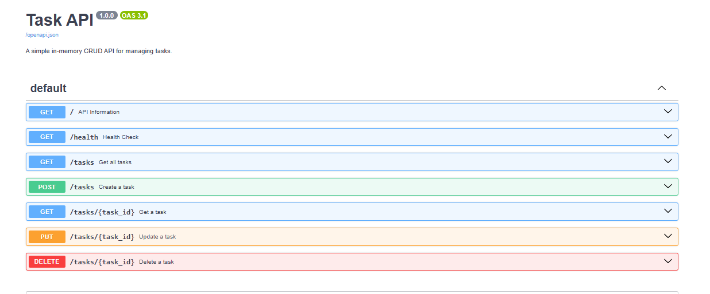

# Task API

A small CRUD API for managing a to-do list, built with **FastAPI**. Data is stored in memory only — it resets every time the server restarts.

Built as part of the FlyRank AI Backend AI Engineering internship, Week 2 · Assignment BE-01.

---

## Tech stack

- Python 3.10+
- [FastAPI](https://fastapi.tiangolo.com/)
- [uvicorn](https://www.uvicorn.org/) (ASGI server)
- [uv](https://docs.astral.sh/uv/) (package/environment manager)

---

## How to run

1. Install [uv](https://docs.astral.sh/uv/) if you don't already have it.
2. Clone this repo and enter the folder:
   ```bash
   git clone https://github.com/AdebankeDev/todo-crud-api.git
   cd todo-crud-api
   ```
3. Start the server:
   ```bash
   uv run uvicorn main:app --reload --port 8000
   ```
4. Open **http://localhost:8000/docs** to explore and test every endpoint interactively via Swagger UI.

That's the one documented command — `uv run uvicorn main:app --reload --port 8000` — no manual virtual environment activation needed.

---

## Endpoints

| Method | Path          | Description                        | Success | Errors        |
|--------|---------------|-------------------------------------|---------|----------------|
| GET    | `/`           | API info                            | 200     | —              |
| GET    | `/health`     | Health check                        | 200     | —              |
| GET    | `/tasks`      | List all tasks                      | 200     | —              |
| GET    | `/tasks/{id}` | Get one task by id                  | 200     | 404 if not found |
| POST   | `/tasks`      | Create a new task                   | 201     | 400 if title missing/empty |
| PUT    | `/tasks/{id}` | Replace a task's title and done status | 200  | 400 invalid body, 404 if not found |
| DELETE | `/tasks/{id}` | Delete a task                       | 204     | 404 if not found |

Each task has the shape:

```json
{ "id": 1, "title": "Buy milk", "done": false }
```

---

## Example request

Listing all tasks:

```bash
curl -i http://127.0.0.1:8000/tasks
```

Response:

```
HTTP/1.1 200 OK
date: Thu, 16 Jul 2026 20:43:36 GMT
server: uvicorn
content-length: 148
content-type: application/json

[{"id":1,"title":"Learn FastAPI","done":false},{"id":2,"title":"Build CRUD API","done":false},{"id":3,"title":"Push project to GitHub","done":true}]
```

---

## Swagger UI

FastAPI generates interactive API docs automatically at `/docs` — no extra setup required.



---

## Notes

- **Validation errors** are returned under FastAPI's default key `detail` (e.g. `{"detail": "Title is required and cannot be empty"}`), not `error` as suggested in the assignment brief — this is FastAPI's built-in convention and was kept as-is since it's still a valid, machine-readable JSON error message.
- **Missing vs. empty title:** posting a body with no `title` field at all returns FastAPI's automatic `422 Unprocessable Entity` (from Pydantic validation). Posting `{"title": ""}` or whitespace-only returns a custom `400 Bad Request` from an explicit check in the code. Both are "invalid input," handled at two different layers.
- **In-memory storage:** all tasks live in a plain Python list inside `main.py`. Restarting the server always resets the list back to the 3 original seed tasks — there is no persistence yet. That's intentional for this stage; a real database is introduced next week.