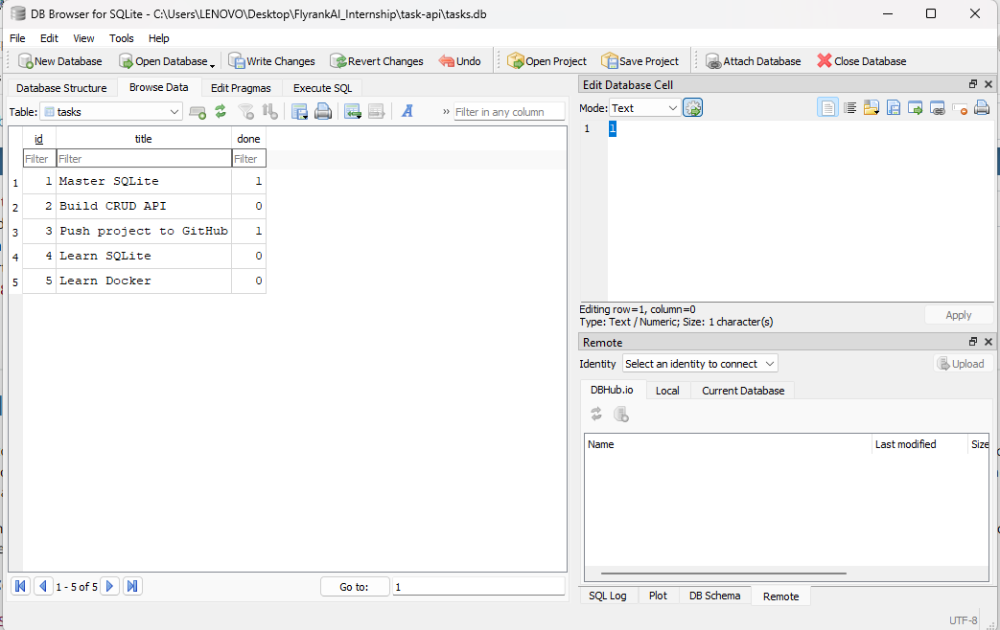
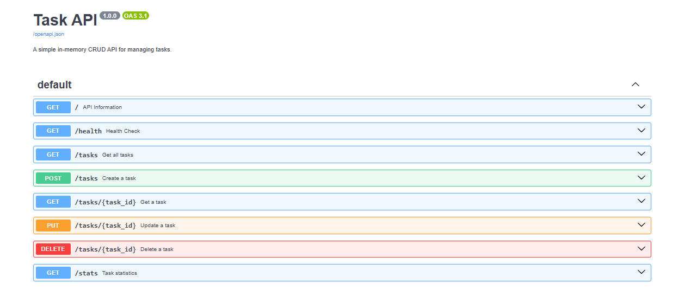

# Task API

A RESTful CRUD API for managing a to-do list, built with **FastAPI** and **SQLite**. This project demonstrates how to build a backend API with persistent data storage using SQL instead of an in-memory Python list.

Built as part of the **FlyRank AI Backend Engineering Internship** – **Week 3: Connecting Your CRUD to the Database**.

---

# Tech Stack

- Python 3.10+
- FastAPI
- SQLite (`sqlite3`)
- Uvicorn (ASGI server)
- uv (package and environment manager)

---

# Why SQLite?

SQLite was chosen because it is a lightweight, serverless relational database that stores all data in a single file (`tasks.db`). It requires no separate database server, making it ideal for learning backend development and building small applications.

Compared to the Week 2 implementation that stored tasks in a Python list, SQLite provides **persistent storage**, so tasks remain available even after restarting the application.

---

# Project Structure

```text
task-api/
│
├── main.py
├── README.md
├── .gitignore
├── images/
│   ├── swagger-ui.png
│   └── db-browser.png
└── tasks.db (created automatically)
```

---

# Database

The application stores all tasks in a SQLite database file named **`tasks.db`**.

When the application starts, it automatically:

1. Creates the SQLite database if it does not exist.
2. Creates the `tasks` table if it does not exist.
3. Seeds the database with three example tasks **only when the table is empty**.

Because `tasks.db` is included in `.gitignore`, every developer who clones the repository starts with a fresh database that is created automatically.

---

# Running the Project

## Clone the repository

```bash
git clone https://github.com/AdebankeDev/todo-crud-api.git
cd todo-crud-api
```

## Start the API

```bash
uv run uvicorn main:app --reload
```

## Open Swagger UI

```
http://127.0.0.1:8000/docs
```

FastAPI automatically generates interactive API documentation where every endpoint can be tested.

---

# Automatic Database Creation

No manual database setup is required.

If `tasks.db` is missing, the application automatically:

- Creates the database
- Creates the `tasks` table
- Inserts three sample tasks

This allows a fresh clone of the repository to run immediately without additional configuration.

---

# API Endpoints

| Method | Endpoint | Description | Success | Errors |
|---------|----------|-------------|---------|--------|
| GET | `/` | API information | 200 | — |
| GET | `/health` | Health check | 200 | — |
| GET | `/tasks` | Retrieve all tasks | 200 | — |
| GET | `/tasks/{id}` | Retrieve a task by ID | 200 | 404 |
| POST | `/tasks` | Create a new task | 201 | 400 |
| PUT | `/tasks/{id}` | Update an existing task | 200 | 400, 404 |
| DELETE | `/tasks/{id}` | Delete a task | 204 | 404 |
| GET | `/stats` | Retrieve task statistics | 200 | — |

---

# Task Model

Each task has the following structure:

```json
{
  "id": 1,
  "title": "Learn FastAPI",
  "done": false
}
```

The `id` is automatically generated by SQLite using the `AUTOINCREMENT` keyword.

---

# Example Request

Retrieve all tasks:

```bash
curl -i http://127.0.0.1:8000/tasks
```

Example response:

```json
[
  {
    "id": 1,
    "title": "Learn FastAPI",
    "done": false
  },
  {
    "id": 2,
    "title": "Build CRUD API",
    "done": false
  },
  {
    "id": 3,
    "title": "Push project to GitHub",
    "done": true
  }
]
```

---

# Optional Feature: Task Statistics

Implemented the optional **`GET /stats`** endpoint that returns statistics about the tasks stored in the database.

Example request:

```bash
curl -i http://127.0.0.1:8000/stats
```

Example response:

```json
{
  "total": 5,
  "done": 2,
  "open": 3
}
```

The endpoint uses SQLite aggregate queries:

```sql
SELECT COUNT(*) FROM tasks;
SELECT COUNT(*) FROM tasks WHERE done = 1;
```

The number of open tasks is calculated as:

```text
open = total - done
```

---

# Manual Database Exploration

The SQLite database was explored using **DB Browser for SQLite**.

The following SQL queries were executed manually during Stage 4:

Retrieve all tasks:

```sql
SELECT * FROM tasks;
```

Retrieve completed tasks:

```sql
SELECT * FROM tasks
WHERE done = 1;
```

Count all tasks:

```sql
SELECT COUNT(*) FROM tasks;
```

Mark every task as completed:

```sql
UPDATE tasks
SET done = 1;
```

Delete all completed tasks:

```sql
DELETE FROM tasks
WHERE done = 1;
```

Running these queries directly in DB Browser demonstrated that FastAPI immediately reflected the changes because both the API and DB Browser access the same SQLite database file.

---

# Database Preview

The database was inspected using **DB Browser for SQLite**.

## Database Preview



---

# Swagger UI

FastAPI automatically generates interactive API documentation.

## Swagger UI



---

# Notes

- FastAPI uses Pydantic for automatic request validation.
- Validation errors are returned under FastAPI's default `detail` field.
- Empty task titles return a custom **400 Bad Request** response.
- SQLite does not have a native Boolean type. Instead, `False` is stored as `0` and `True` is stored as `1`.
- The `id` field is automatically generated using SQLite's `AUTOINCREMENT`.
- Database changes are persisted using `connection.commit()`.
- If `tasks.db` is deleted, it is recreated automatically the next time the application starts.

---

# Features

- FastAPI REST API
- SQLite database
- Persistent storage
- Automatic database creation
- Automatic database seeding
- CRUD operations
- Task statistics endpoint
- Interactive Swagger documentation
- Manual SQL exploration with DB Browser


# Author

**Adebanke Peke**

FlyRank AI Backend Engineering Internship

Week 3 Assignment – Connecting CRUD to SQLite

Built with Python, FastAPI, SQLite, and GitHub.